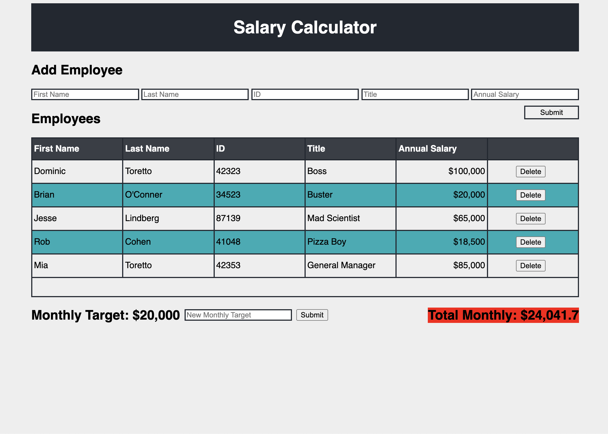

# Salary Calculator

## Description

*Duration: 3 days.*

An application that can be used to calculate the total monthly salaries of a company's employees. The calculator runs the math when employees are added and deleted. If the total total monthly salary is over budget, it will be alerted by the total monthly number at the bottom changing to a red background.

The application takes 5 employee inputs - First name, Last name, Employee ID, Title, Annual Salary.

When the submit button is clicked, these inputs are stored into an array of employees, and then the information is appended to the DOM in the table below with a corresponding delete button for that row.

The inputs are then cleared to their placeholder values for more employees to be added.

A global index variable is used to give each row and its corresponding delete button unique identifiers for event handlers to be used to delete them.

The delete button also corresponds to that employee's index in the array, and splices it.

When adding or removing an employee, a function is ran to calculate the current employees of the array's total salaries down to monthly salaries, and then appended to the DOM.

When the total monthly value is over the desired budget, a css class is added to alert this with a red background. The class is removed when the total monthly value goes back under the desired budget.

Monthly target is displayed on the DOM, next to a monthly target input, and a submit button. A new monthly target can be submitted to the user's desire and will update the red background alert, and display the current monthly target.

## Screenshot

 (Not shown: monthly target, monthly target input, monthly target submit button)

## Installation

Clone the repository. Open index.html in a browser. 

## Usage

1. Open index.html in a browser.
2. Type employee inputs in the corresponding input fields.
3. Click the submit button to add an employee to the table.
4. If employees need to be removed, click the delete button on the row with the corresponding employee.
5. Monthly target default $20,000. To change use the New Monthly Target input at the bottom left.

## Built With

HTML
CSS
JavaScript
jQuery

## Acknowledgement

Thanks to Prime Digital Academy for the never ending knowledge and motivation to continue learning while creating applications like this.

## Support

If you have suggestions, questions, or issues, please email me at husomichael@gmail.com